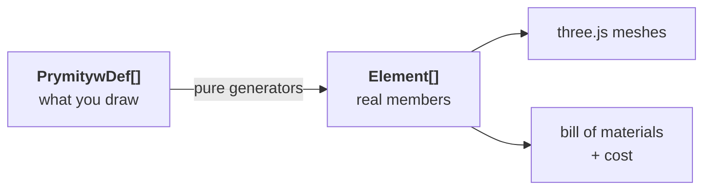

# timberframe-studio

**Parametric CAD for small timber structures** — timber-frame cabins (35–60 m²), decks, carports and lean-to roofs. Draw a floor plan, pick real lumber from a catalogue, and get a live 3D model with a bill of materials and a cost estimate.

> ⚠️ **Work in progress.** This is an early prototype built in a single afternoon. It works end to end, but plenty is missing and rough — see [Status](#status). Not a structural engineering tool: it does **no** load calculations and is not a substitute for a qualified designer.


## The idea

Three steps, left to right across the screen:

1. **Draw** — lay out the plan on a snapping grid. Walls and beams are lines, posts are points, decks and roofs are rectangles. Drag anything to move it; grab a handle to reshape it. Snapping prefers existing geometry over the grid, so walls meet exactly.
2. **Pick** — select an element and choose a real cross-section (45×145, 100×100, …), a timber species and grade (C24, KVH, glulam GL24h, pressure-treated, larch) and a sheathing material. Every catalogue entry carries a price.
3. **Visualise** — the 3D view rebuilds as you edit. Toggle between the finished building and a framing-only view.

Every primitive expands into **real individual members** — each stud, rafter and deck board is its own mesh, not one merged blob. That is what makes the bill of materials trustworthy: it is counted from the same geometry you are looking at.


## What it does today

- **Construction primitives** — post, beam, knee brace, deck, mono-pitch roof, gable roof, and stud wall with window/door openings (headers, sills and cripple studs generated automatically).
- **Direct manipulation** — drag to move, handles to resize, snap to existing points, undo/redo, delete.
- **Lumber catalogue** — commercial cross-sections, seven species/grades with per-m³ prices, eight sheathing materials with per-m² prices.
- **Bill of materials and cost** — grouped by member, section and species, with piece counts, cut lengths, running metres, m², m³ and cost. Fasteners (post bases, anchors, angle brackets, structural screws) are added from per-connection rules.
- **Mitred ends** — knee braces get their end faces cut to the angle derived from their pitch, so they seat flat against post and beam. The bill of materials orders the longer edge, not the centreline.
- **Persistence** — the project autosaves to `localStorage`; export/import as JSON, export the bill of materials as CSV.
- **Starter templates** — 6×7 m timber-frame cabin with a covered deck, 4×6 m carport, 3×3 m carport.

## Quick start

```bash
pnpm install
pnpm dev
```

Then load a template from the **Szablon…** dropdown in the toolbar and hit **Dopasuj** to frame the view.

```bash
pnpm build     # typecheck + production build
pnpm lint
```

> **Note:** the interface is currently **Polish only**, as are the identifiers in the source. The domain vocabulary (`słup` = post, `belka` = beam, `krokiew` = rafter, `zastrzał` = knee brace, `oczep` = top plate, `podwalina` = sill plate) is deliberate — it matches how drawings and lumber orders are actually written here.

## How it works

The core is a two-stage pipeline with a hard boundary in the middle:



- A **primitive** is what you draw: a wall from A to B, 2.6 m tall, 60 mm studs at 600 mm centres.
- A **generator** is a pure function `Def → Element[]` with no dependencies beyond arithmetic. The wall generator emits a sill plate, a top plate, every stud, every header and every sheathing panel as separate elements. Because generators are pure they run outside the browser — the geometry in this repo was verified by executing them in Node and checking coordinates, not by eyeballing screenshots.
- An **element** is a single physical member: an axis from `od` to `do` in 3D, a cross-section, a species, optional end-cut angles. One representation covers a 200×200 post, a deck board and an OSB panel, which is why there is exactly one renderer and one costing path.

```
src/
  model/
    typy.ts               primitive definitions + the universal Element
    katalog.ts            sections, species, sheathing, fasteners — with prices
    generatory/           pure Def → Element[] functions, one per primitive
    materialy.ts          bill of materials, fastener rules, cost, CSV
  rzut/                   2D plan editor (SVG): drawing, snapping, dragging
  scena/                  3D preview (react-three-fiber)
  ui/                     toolbar, property panel, BOM table
  projekty/               starter templates
```

## Status

Working: drawing, dragging and reshaping, the catalogue, the bill of materials with costs, persistence, both roof types, walls with openings, braces with mitred ends.

Not there yet:

- **Rafters still have square ends.** They should be cut to the roof pitch at the ridge and vertically at the eaves. The end-cut mechanism already exists on `Element` — the roof generators just do not use it.
- No rotation about an element's own centre, no multi-select, no copy/paste.
- No dimension chains between elements; distances have to be read off coordinates.
- The origin cannot be moved, and there are no local coordinate systems.
- Braces drawn diagonally in plan get their pitch cuts right but not the side cuts against the beam.
- Deck boards are whole boards only — the last few centimetres of a deck are left uncovered instead of ripping a board to width.
- **Prices are indicative** Polish-market figures hard-coded in `katalog.ts`. Treat the totals as an order-of-magnitude estimate and update the catalogue before quoting anyone.

## Built with

Vite · React · TypeScript · three.js via react-three-fiber and drei · zustand · pnpm

Units are metres throughout; the coordinate system is X/Y on the ground with Z up.

## License

MIT © Krzysztof Pika — see [LICENSE](LICENSE).
